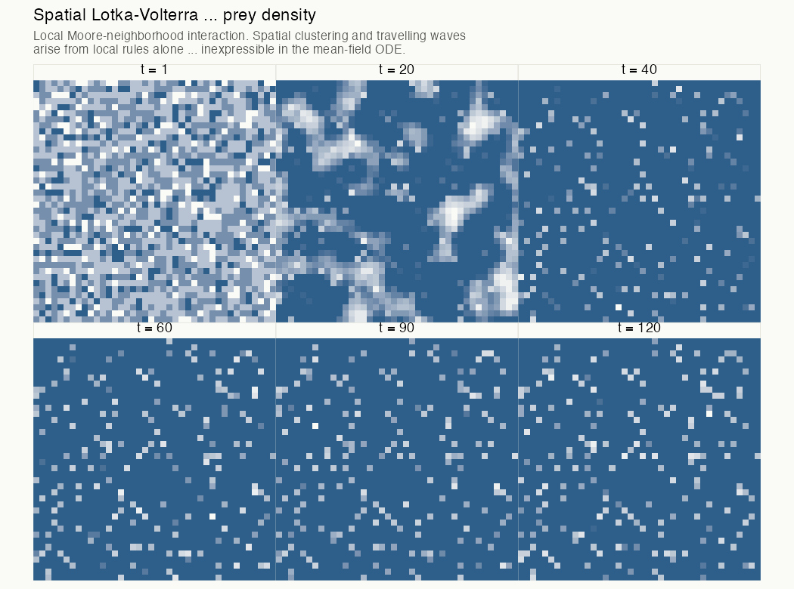

```{r setup, include=FALSE}
knitr::opts_chunk$set(
  echo      = TRUE,
  warning   = FALSE,
  message   = FALSE,
  fig.retina = 3,
  fig.align  = "center"
)

library(tidyverse)
library(deSolve)
library(igraph)
library(tidygraph)
library(ggraph)
library(gganimate)
library(patchwork)

theme_set(
  theme_minimal(base_family = "Source Serif 4") +
    theme(
      plot.title       = element_text(family = "Raleway", face = "plain",
                                      size = 14, margin = margin(b = 8)),
      plot.subtitle    = element_text(family = "Source Serif 4", size = 11,
                                      color = "#555555", margin = margin(b = 12)),
      axis.title       = element_text(family = "Source Serif 4", size = 10),
      legend.position  = "bottom",
      panel.grid.minor = element_blank(),
      plot.background  = element_rect(fill = "#FAFAF7", color = NA)
    )
)

palette_ch2 <- c(
  prey        = "#2D5F8A",
  predator    = "#8A4A2D",
  susceptible = "#2D5F8A",
  infectious  = "#C0392B",
  recovered   = "#27AE60"
)
```

---

## Block 2: Agents, Networks, and the Geometry of Interaction

.pull-left[
**The argument**

- What an agent is — and what the neighborhood means
- ABM Lotka-Volterra: the reduction result, then the gap
- ABM SIR: random mixing, then network structure
- The reduction theorem stated cleanly
- Nominal parameters versus effective dimensionality
]

.pull-right[
**The conclusion**

The ODE is not a competing paradigm. It is a limiting case — what the ABM becomes when the mean-field assumption is exact. Every ABM that includes random mixing contains the ODE as a theorem.

What lies outside that limit is the subject of this block.
]

???
Speaker notes: Set the tone immediately: this is not an argument that ODE models are wrong. It is a demonstration that they are a special case of a richer language. The statistician analogy that will carry the session is regularization — the ODE is the ABM with a very strong prior. Do not state this yet. Let it arrive after the reduction result is shown.

---

## What Is an Agent?

An agent is an entity with three things:

--

**A state.** A set of variables that describe the agent at a given moment — species, health status, wealth, location, opinion.

--

**Rules.** A function from the agent's current state and its neighborhood to its next state. Not a utility function. Not an optimization. A rule.

--

**A neighborhood.** A set of other agents it can interact with — the agents that appear in its rules.

--

The neighborhood is the structural innovation. In the ODE, every agent's neighborhood is the entire population, weighted uniformly. In the ABM, the neighborhood is local, structured, and can differ across agents.

What you can say in this language that you cannot say in the ODE's language — that is the point.

???
Speaker notes: The neighborhood concept is the load-bearing idea. Everything else follows from it. In the ODE, the neighborhood is implicit and uniform — the mass-action term embeds it without naming it. In the ABM, it is explicit and potentially heterogeneous. This makes it a first-class object: something you can vary, model, and test hypotheses about. Statisticians will recognize the analogy to specifying a covariance structure — the ODE is like assuming independence, the ABM lets you specify the structure.

---

## ABM Lotka-Volterra: The Rules

Three rules. No differential equations required.

--

**Rule 1 — Prey reproduction:** At each timestep, each living prey agent reproduces with probability $p_{\text{birth}}$. A new prey agent is added to the population.

--

**Rule 2 — Predation:** Each living predator is paired with a randomly selected prey agent. With probability $p_{\text{eat}}$, the prey is removed and a new predator is added.

--

**Rule 3 — Predator death:** Each living predator dies with probability $p_{\text{death}}$ per timestep.

--

Random pairing in Rule 2 is the mean-field assumption — explicit, named, and adjustable. We can relax it. We will.

???
Speaker notes: The rules are deliberately verbal before they are computational. This is intentional — the verbal statement is the model; the code is just the execution. A model that can only be described in code is a model that cannot be criticized. These three rules map directly to the three terms in the Lotka-Volterra ODEs: alpha*N, beta*N*P, gamma*P. The correspondence will be made visible in the reduction result.

---

## ABM Lotka-Volterra: Core Code

```{r abm-lv-def, echo=TRUE}
set.seed(42)
step_lv <- function(pop, p_birth = 0.15, p_kill = 0.00375,
                    p_convert = 0.267, p_death = 0.10) {
  prey <- filter(pop, type == "prey")
  pred <- filter(pop, type == "predator")
  N <- nrow(prey); P <- nrow(pred)
  nb <- rbinom(1, N, p_birth)           # Rule 1: prey reproduce
  new_prey <- tibble(id = max(pop$id) + seq_len(nb), type = "prey")
  kills <- rbinom(P, N, p_kill)         # Rule 2: each predator kills Binom(N,p_kill) prey
  dead  <- unique(unlist(lapply(kills[kills > 0],
             function(k) slice_sample(prey, n = min(k, N))$id)))
  prey  <- filter(prey, !id %in% dead)
  np    <- rbinom(1, length(dead), p_convert)
  new_pred <- tibble(id = max(pop$id) + nb + seq_len(np), type = "predator")
  pred  <- pred[rbinom(P, 1, 1 - p_death) == 1, ]  # Rule 3: predators die
  bind_rows(prey, pred, new_prey, new_pred)
}
```

???
Speaker notes: The code structure mirrors the verbal rules exactly. `rbinom` calls make the stochasticity explicit. Rule 2 is the mean-field assumption in code: each predator independently samples every prey individual with probability `p_kill`. The expected number of kills is `p_kill × N × P = β N P` — the functional form $\beta NP$ written procedurally. `p_kill` maps directly to β; `p_kill × p_convert` maps to δ.

---

```{r abm-lv-run, echo=TRUE}
run_lv_abm <- function(T = 300, n_prey0 = 60, n_pred0 = 15,
                       p_birth = 0.15, p_kill = 0.00375,
                       p_convert = 0.267, p_death = 0.10, seed_val = 42) {
  set.seed(seed_val)
  pop <- tibble(id   = seq_len(n_prey0 + n_pred0),
                type = c(rep("prey", n_prey0), rep("predator", n_pred0)))
  counts <- tibble(time = 0L, prey = n_prey0, predator = n_pred0)
  for (t in seq_len(T)) {
    if (nrow(filter(pop, type == "prey")) == 0 ||
        nrow(filter(pop, type == "predator")) == 0) break
    pop    <- step_lv(pop, p_birth, p_kill, p_convert, p_death)
    counts <- add_row(counts, time = t, prey = sum(pop$type == "prey"),
                      predator = sum(pop$type == "predator"))
  }
  counts
}
abm_runs <- map_dfr(1:10, ~ run_lv_abm(seed_val = .x) |> mutate(run = .x))
```

???
Speaker notes: The early termination condition — `if (nrow(...) == 0) break` — is doing something the ODE cannot: it is detecting extinction. The ODE trajectory would continue through zero and into negative population sizes without complaint. The ABM respects the absorbing boundary.

---

## The ODE Is Not a Different Model

Before showing the comparison:

The ODE is not a competing model of the same system.

It is what *this* model — the ABM with random pairing — becomes when you take the mean-field assumption to its limit: infinite population, perfect randomness at every timestep, all stochastic variation averaging away.

--

The ODE is the ABM's expectation under the mean-field assumption. The ABM is the ODE with the mean-field assumption relaxed.

--

An ODE is an ABM under maximal regularization.

???
Speaker notes: State this before showing the reduction plot, not after. If you show the convergence first and then explain it, it looks like post-hoc justification. If you explain it first, the plot arrives as confirmation of a prediction. This is the rhetorical structure of the reduction result: the ABM is the more general model, and the ODE falls out of it as a theorem. Not as an approximation — as a theorem.

---

## The Reduction Result

```{r lv-reduction-plot, echo=FALSE, fig.height=4.2, fig.width=11}
# ODE solution for comparison (matching ABM parameters approximately)
lotka_volterra <- function(t, state, parameters) {
  with(as.list(c(state, parameters)), {
    dN <- alpha * N - beta * N * P
    dP <- delta * N * P - gamma * P
    list(c(dN, dP))
  })
}
# Calibrate ODE parameters to match ABM rates roughly
params_ode <- c(alpha = 0.06, beta = 0.04/60, delta = 0.04/60, gamma = 0.08)
state0_ode <- c(N = 60, P = 15)
times_ode  <- seq(0, 300, by = 1)
lv_ode_df  <- as_tibble(as.data.frame(
  ode(y = state0_ode, times = times_ode,
      func = lotka_volterra, parms = params_ode)
))

p_prey <- ggplot() +
  # ABM ribbons — stochastic variation as translucent lines
  geom_line(data = abm_runs,
            aes(x = time, y = prey, group = run),
            color = "#2D5F8A", alpha = 0.25, linewidth = 0.6) +
  geom_line(data = lv_ode_df,
            aes(x = time, y = N),
            color = "#2D5F8A", linewidth = 1.4) +
  labs(title = "Prey", x = "Time", y = "Count")

p_pred <- ggplot() +
  geom_line(data = abm_runs,
            aes(x = time, y = predator, group = run),
            color = "#8A4A2D", alpha = 0.25, linewidth = 0.6) +
  geom_line(data = lv_ode_df,
            aes(x = time, y = P),
            color = "#8A4A2D", linewidth = 1.4) +
  labs(title = "Predator", x = "Time", y = "Count")

p_prey + p_pred +
  plot_annotation(
    title    = "ABM (translucent) over ODE (solid): the reduction result",
    subtitle = "Random mixing, N = 75 — ABM tracks ODE mean; stochastic noise visible"
  )
```

???
Speaker notes: The solid line is the ODE. The translucent traces are ten ABM runs with different random seeds. At this population size, the ABM orbits near the ODE solution — but notice the variance. Some runs track closely; a few diverge. The divergence will become the subject of the next slide. The key message: convergence is real, but it requires large N and random mixing. Both conditions are assumptions of the ODE.

---

## The ODE Cannot See This

```{r lv-extinction, echo=FALSE, fig.height=4.0, fig.width=11}
set.seed(99)
# Small-population ABM — extinction events become common
small_runs <- map_dfr(1:20, ~ run_lv_abm(
  T = 300, n_prey0 = 20, n_pred0 = 8,
  p_birth = 0.15, p_kill = 0.00375, p_convert = 0.267, p_death = 0.10,
  seed_val = .x
) |> mutate(run = .x))

# ODE for small population — same parameters, same initial conditions
state0_small <- c(N = 20, P = 8)
lv_small_ode <- as_tibble(as.data.frame(
  ode(y = state0_small, times = times_ode,
      func = lotka_volterra, parms = params_ode)
))

p_extinct <- ggplot() +
  geom_line(data = small_runs,
            aes(x = time, y = prey, group = run),
            color = "#2D5F8A", alpha = 0.3, linewidth = 0.6) +
  geom_line(data = lv_small_ode,
            aes(x = time, y = N),
            color = "#2D5F8A", linewidth = 1.4) +
  labs(title = "Prey (N = 20 initial)",
       subtitle = "ODE orbits forever — ABM can collapse to zero",
       x = "Time", y = "Prey count")

p_extinct
```

**The ODE's language has no word for extinction.** The absorbing state at zero is outside its expressive range.

???
Speaker notes: Some of the translucent lines hit zero and stay there — extinction. The ODE line continues cycling, because a differential equation defined at the origin has no mechanism for absorbing state dynamics. The ODE is not wrong about the populations it was designed to describe — large, well-mixed, continuous. It is incapable of expressing a phenomenon that requires discreteness and small-number stochasticity. The ODE cannot say "the population went extinct." The phrase is grammatically forbidden in its language.

---

## ABM SIR: Random Mixing

```{r abm-sir-def, echo=TRUE}
set.seed(123)
run_abm_sir <- function(N = 500, beta = 0.3, gamma = 0.1,
                        T = 150, seed_val = 123) {
  set.seed(seed_val)
  status  <- c("I", rep("S", N - 1))
  results <- tibble(time = 0L, S = N - 1L, I = 1L, R = 0L)
  for (t in seq_len(T)) {
    inf  <- which(status == "I"); susc <- which(status == "S")
    if (length(inf) > 0 && length(susc) > 0) {
      # Random mixing — mean-field assumption in agent code
      ctc <- sample(susc, min(length(inf), length(susc)))
      status[ctc[rbinom(length(ctc), 1, beta) == 1]] <- "I"
    }
    status[inf[rbinom(length(inf), 1, gamma) == 1]] <- "R"
    results <- add_row(results, time = t, S = sum(status == "S"),
                       I = sum(status == "I"), R = sum(status == "R"))
  }
  results
}
abm_sir_runs <- map_dfr(1:8, ~ run_abm_sir(seed_val = .x) |> mutate(run = .x))
```

???
Speaker notes: The infection mechanism here is random mixing: each infectious agent draws a random susceptible. This is the mean-field assumption in agent code. The recovery is a Bernoulli trial at each timestep with probability gamma — which gives a geometric distribution of infectious periods, the continuous analog of the exponential distribution in the ODE. The ODE assumes exponentially distributed infectious periods; this ABM implements that assumption discretely.

---

## ABM SIR: Convergence to ODE

```{r sir-convergence-plot, echo=FALSE, fig.height=4.2, fig.width=11}
sir_ode <- function(t, state, parameters) {
  with(as.list(c(state, parameters)), {
    list(c(-beta * S * I / N,
            beta * S * I / N - gamma * I,
            gamma * I))
  })
}
N_sir <- 500
params_sir_ode <- c(beta = 0.3, gamma = 0.1, N = N_sir)
state_sir_ode  <- c(S = N_sir - 1, I = 1, R = 0)
times_sir_ode  <- seq(0, 150, by = 1)
sir_ode_df <- as_tibble(as.data.frame(
  ode(y = state_sir_ode, times = times_sir_ode,
      func = sir_ode, parms = params_sir_ode)
))

ggplot() +
  geom_line(data = abm_sir_runs,
            aes(x = time, y = I, group = run),
            color = "#C0392B", alpha = 0.3, linewidth = 0.7) +
  geom_line(data = sir_ode_df,
            aes(x = time, y = I),
            color = "#C0392B", linewidth = 1.5) +
  labs(title    = "Infectious count: ABM (translucent) vs. ODE (solid)",
       subtitle = "N = 500, random mixing — ABM converges to ODE mean",
       x = "Time (days)", y = "Infectious individuals")
```

???
Speaker notes: The convergence is clear at N = 500. The ABM runs cluster tightly around the ODE solution — peak timing, peak height, and tail behavior all align. The residual variance is demographic stochasticity: the irreducible randomness of a finite population. As N grows, this variance shrinks and the ABM approaches the ODE exactly. This is the reduction result for SIR.

---

## Now Give Them an Address

Everything shown so far maintains the mean-field assumption. Random pairing means every agent's neighborhood is the entire population.

--

The neighborhood, previously a uniform draw from the full population at every timestep, becomes a specific set of nodes in a graph.

--

Agents have contact networks. A person's neighborhood is not "the population" — it is a set of specific individuals: household members, coworkers, transit contacts, friends. These relationships are persistent, structured, and heterogeneous.

--

What happens to an epidemic when you give the population a contact network?

???
Speaker notes: The transition here is from the ODE's abstraction (the fully mixed population) to a structure that looks more like how transmission actually works. The key point is not that contact networks are "more realistic" — it is that they introduce a new structural object, the network topology, which is not representable in the ODE's language. Network topology is a first-class variable in this language. You can ask questions about it. You can vary it and observe the consequences.

---

## Two Networks, Same Mean Degree

```{r network-gen, echo=TRUE}
set.seed(77)  # for reproducibility
N_net  <- 300
k_mean <- 6   # mean degree for both networks

# Erdős-Rényi: random graph, Poisson degree distribution
er_graph <- sample_gnp(N_net, p = k_mean / (N_net - 1))

# Barabási-Albert: preferential attachment, power-law degree distribution
ba_graph <- sample_pa(N_net, m = k_mean / 2, directed = FALSE)

# Convert to tidygraph for visualization
er_tg <- as_tbl_graph(er_graph) |>
  mutate(degree = centrality_degree())
ba_tg <- as_tbl_graph(ba_graph) |>
  mutate(degree = centrality_degree())
```

Both networks have $\bar{k} \approx 6$. The same $\mathcal{R}_0$ applies to both.

???
Speaker notes: Mean degree is fixed to isolate the effect of topology on epidemic dynamics. Everything else — transmission rate, recovery rate, initial infected fraction — will be identical. If the ODE were the correct model, we would see identical epidemic curves. What we will see is something quite different.

---

## The Networks: Erdős-Rényi vs. Barabási-Albert

```{r network-viz, echo=FALSE, fig.height=4.5, fig.width=11}
set.seed(55)

# Subsample for visualization clarity
er_sub <- er_tg |> activate(nodes) |> slice_sample(n = 80)
ba_sub <- ba_tg |> activate(nodes) |> slice_sample(n = 80)

p_er <- ggraph(er_sub, layout = "fr") +
  geom_edge_link(alpha = 0.2, color = "#AAAAAA") +
  geom_node_point(aes(size = degree), color = "#2D5F8A", alpha = 0.8) +
  scale_size_continuous(range = c(1, 6), guide = "none") +
  labs(title = "Erdős–Rényi", subtitle = "Degree ≈ Poisson(6)") +
  theme_graph(base_family = "Source Serif 4") +
  theme(plot.background = element_rect(fill = "#FAFAF7", color = NA))

p_ba <- ggraph(ba_sub, layout = "fr") +
  geom_edge_link(alpha = 0.2, color = "#AAAAAA") +
  geom_node_point(aes(size = degree), color = "#8A4A2D", alpha = 0.8) +
  scale_size_continuous(range = c(1, 6), guide = "none") +
  labs(title = "Barabási–Albert", subtitle = "Degree ~ power law: a few very high-degree hubs") +
  theme_graph(base_family = "Source Serif 4") +
  theme(plot.background = element_rect(fill = "#FAFAF7", color = NA))

p_er + p_ba +
  plot_annotation(
    title = "Contact network structure: same mean degree, different topology",
    subtitle = "Node size proportional to degree"
  )
```

???
Speaker notes: The visual difference is immediate and striking. In the Erdős-Rényi graph, nodes are roughly uniform in size — similar degrees throughout. In the Barabási-Albert graph, a few large nodes (hubs) dominate. These hubs are connected to many other nodes. In an epidemic, they are both highly likely to be infected early (many contacts) and highly efficient at spreading infection further. The ODE sees only mean degree. It is blind to the variance.

---

## Erdős-Rényi vs. Barabási-Albert: What the Degree Distribution Implies

.pull-left[
**Erdős-Rényi**
- Degree distribution: Poisson
- No hubs — variance is low
- An epidemic spreads at roughly uniform speed through the network
- Final size and peak timing predictable from $\mathcal{R}_0$
]

.pull-right[
**Barabási-Albert**
- Degree distribution: power law
- A few hubs with very high degree
- Hubs infected early; epidemic spreads rapidly through them
- Faster initial growth, potentially larger final size
- Hubs as both amplifiers and potential targets for intervention
]

--

The ODE sees neither of these structures. It sees mean degree, and nothing else.

???
Speaker notes: The policy implication of the Barabási-Albert topology is significant: targeted vaccination of hubs is dramatically more efficient than random vaccination, because hubs carry a disproportionate share of the transmission. The ODE cannot represent this strategy. The network SIR can. This is not a matter of fit — it is a matter of the question being askable.

---

## Network SIR: Edge-Traversal Infection

```{r network-sir-def, echo=TRUE}
set.seed(101)
run_network_sir <- function(graph, N, beta = 0.15, gamma = 0.1,
                            T = 80, seed_val = 101) {
  set.seed(seed_val)
  status <- rep("S", N); status[sample(N, 1)] <- "I"
  adj    <- lapply(as_adj_list(graph), as.integer)
  results <- tibble(time = 0L, S = N - 1L, I = 1L, R = 0L)
  for (t in seq_len(T)) {
    new_st <- status
    for (i in which(status == "I")) {
      nb_s <- adj[[i]][status[adj[[i]]] == "S"]    # edges only — no mean-field
      new_st[nb_s[rbinom(length(nb_s), 1, beta) == 1]] <- "I"
      if (rbinom(1, 1, gamma) == 1) new_st[i] <- "R"
    }
    status  <- new_st
    results <- add_row(results, time = t, S = sum(status == "S"),
                       I = sum(status == "I"), R = sum(status == "R"))
  }
  results
}
```

```{r network-sir-run, echo=FALSE}
er_sir_runs <- map_dfr(1:10,
  ~ run_network_sir(er_graph, N_net, seed_val = .x) |>
    mutate(network = "Erdos-Renyi", run = .x))
ba_sir_runs <- map_dfr(1:10,
  ~ run_network_sir(ba_graph, N_net, seed_val = .x) |>
    mutate(network = "Barabasi-Albert", run = .x))
network_sir_runs <- bind_rows(er_sir_runs, ba_sir_runs)
```

???
Speaker notes: The critical structural change from the random-mixing ABM: infection now traverses edges only. `adj[[i]]` gives the neighbors of node i; susceptibles among them are the only candidates for transmission. The ODE's $\beta SI$ term is replaced by edge-by-edge Bernoulli trials. The contact structure is now load-bearing, not abstracted away.

---

## Same $\mathcal{R}_0$. Different World.

```{r network-epidemic-curves, echo=FALSE, fig.height=4.5, fig.width=11}
network_sir_runs |>
  ggplot(aes(x = time, y = I,
             color = network, group = interaction(network, run))) +
  geom_line(alpha = 0.35, linewidth = 0.7) +
  stat_summary(aes(group = network),
               fun = mean, geom = "line",
               linewidth = 1.6) +
  scale_color_manual(
    values = c("Erdos-Renyi" = "#2D5F8A",
               "Barabasi-Albert" = "#8A4A2D"),
    name = NULL
  ) +
  labs(title    = "Epidemic curves by contact network topology",
       subtitle = "Same β, γ, N — thick lines are run averages",
       x = "Time (days)", y = "Infectious individuals") +
  theme(legend.position = "bottom")
```

???
Speaker notes: Both networks have the same mean degree and the same transmission parameters. The ODE predicts one epidemic curve. These networks produce qualitatively different dynamics: the Barabási-Albert epidemic peaks earlier, shows more variance across runs (because hub-seeding is a random event), and can sustain longer tails through hub persistence. The ODE's answer is neither of these — it is the mean-field average, which corresponds to neither topology. The question "what does contact network topology do to epidemic dynamics?" cannot be asked in the ODE's language. The answer it would give is not wrong. The question is simply exterior to its expressive range.

---

## The Reduction Theorem

Stated cleanly:

As population size grows, as mixing becomes increasingly random, and as individual heterogeneity averages out across the population, the ABM converges in distribution to the ODE.

--

The ODE is not wrong — it is a limiting case. It is what the ABM becomes when the mean-field assumption is exact. Every ABM that includes random mixing as a special case contains the ODE as a theorem.

--

This dissolves the apparent competition between the two paradigms. There is no competition. There is a richer language and one of its sublanguages. The question is always whether the phenomena of interest are expressible in the sublanguage — and for many of the most consequential social and biological phenomena, they are not.

???
Speaker notes: This is the central theoretical claim of the session. State it with confidence. The Bayesian framing is available here if the audience wants it: the ODE is the posterior mode of the ABM under a Dirac prior on the interaction structure. The ABM relaxes that prior. The phenomena visible only in the ABM are those that have probability zero under the ODE's prior — not unlikely, but grammatically excluded. Regime change, extinction, network effects, spatial heterogeneity: all exterior to the language.

---

## Nominal Parameters vs. Effective Dimensions

The ABM has more nominal parameters than the ODE: $p_{\text{birth}}$, $p_{\text{eat}}$, $p_{\text{death}}$, population size, initial conditions, network structure (when added).

--

But the calibrated dynamics are not more complex. Most of the parameter space produces qualitatively identical behavior — cycles, damped oscillations, or extinction. The consequential structure lives on a low-dimensional manifold.

--

This is regularization. The parameter space is high-dimensional in name; the effective dimensionality of the calibrated model is low.

--

A statistician who has used LASSO to recover a sparse signal from a high-dimensional regression has already solved this problem in a different guise. The critic who objects to ABM parameter proliferation is counting nominal parameters. They should count effective dimensions.

???
Speaker notes: This is the answer to the most common technical objection to ABMs — placed here, after the full demonstration, so it answers a question the audience has already formed rather than anticipating one they haven't. The Bayesian framing: maximal regularization corresponds to a prior concentrated entirely on the mean-field interaction structure — one that assigns essentially all mass to random mixing. That is not parameter parsimony; it is a structural restriction that has been silently imposed.

---

## Spatial Lotka-Volterra

*Extension module — distributed in course materials; not walked through in the live session.*

Agents occupy cells on a grid. Interactions are local — each agent can only interact with its Moore neighborhood (8 adjacent cells). No global mixing.

--

The result:

**Spiral waves.** A dynamical regime that does not exist in the mean-field model. Space generates structure — coherent, rotating patterns that sustain populations the mean-field equations would drive to extinction.

???
Speaker notes: The animation is the argument. Description cannot substitute for the visual. The spatial model requires roughly 30 additional lines of code — fully commented in the distributed materials. The key point is not the complexity of the implementation but the novelty of the phenomenon: spiral waves are a qualitatively distinct regime, not a quantitative deviation from the ODE trajectory. They require the spatial language to exist at all. Show the animation and let it speak.

---

```{r spatial-lv-code, echo=TRUE, eval=FALSE}
# Spatial LV: each cell holds prey/predator counts
# Full code: code/ch02_abm_contrast.R and slides/render_spatial_anim.R
set.seed(2025)
GRID <- 40; T_MAX <- 100

grid <- expand_grid(x = 1:GRID, y = 1:GRID) |>
  mutate(prey = 0L, predator = 0L)

# Moore neighborhood: 8 adjacent cells — local interaction, not mean-field
moore_nbrs <- function(x, y, g = GRID) {
  dx <- c(-1L,0L,1L,-1L,1L,-1L,0L,1L)
  dy <- c(-1L,-1L,-1L,0L,0L,1L,1L,1L)
  list(x = ((x + dx - 1L) %% g) + 1L,
       y = ((y + dy - 1L) %% g) + 1L)
}
# step_spatial_lv(), simulation loop, and anim_save()
# in distributed materials — see render_spatial_anim.R
```

???
Speaker notes: Show this code briefly to demonstrate the structure — grid, Moore neighborhood, local interaction. Then switch to the pre-rendered animation. The key conceptual point is that `moore_nbrs` has replaced `sample(full_population)` — the neighborhood is now local, and the mean-field assumption is gone. That single change generates qualitatively different dynamics: spiral waves, sustained population structure, persistence regimes that the mean-field model cannot support.

---

## [Animation] Spatial Lotka-Volterra

.center[
```{r spatial-lv-anim, echo=FALSE, out.width="55%"}

```
]

Spiral waves are a dynamical regime that is simply inexpressible in the mean-field language — they require the spatial language to exist at all.

???
Speaker notes: If the animation is available, show it here. If not, describe what the audience would see: coherent rotating patterns of prey and predator populations, moving across the grid, sustaining each other through local dynamics that the global mean-field equations destroy. The phenomenon is not a quantitative correction to the ODE. It is a qualitative regime that the ODE cannot represent at all. This is the clearest demonstration of expressive resolution in the course.

---

## Block 2: Summary

.pull-left[
**What we showed**

- The ABM is a more general language; the ODE is its mean-field limit
- Random mixing → ABM converges to ODE (the reduction result)
- Small populations → extinction; the ODE has no word for it
- Contact network topology changes epidemic dynamics qualitatively — same $\mathcal{R}_0$, different world
- Spatial structure generates phenomena exterior to the mean-field language
]

.pull-right[
**What this means**

- The ODE is an ABM under maximal regularization
- The "too many parameters" objection counts nominal dimensions, not effective ones
- The question is always: is the phenomenon I care about expressible in this language?
- If yes, use the simpler language
- If no, the simpler language does not merely give the wrong answer — it cannot give any answer
]

???
Speaker notes: The summary should feel like a crystallization, not a list. The key points to land: (1) the competition between ODE and ABM is false — one contains the other; (2) the expressive boundary is the operative concept; (3) the statistician's instinct toward model parsimony is correct, but parsimony should be measured in effective dimensions, not parameter counts; (4) the phenomena visible only in the ABM are exactly those that require the features the ODE's language excludes.

---

## Toward Axtell

Block 3 asks a different kind of question.

Not "what happens to a population over time?" but "what is the distribution of outcomes across entities at a point in time?"

The firm size distribution is measured across millions of firms. It has been stable for decades, across countries with radically different institutions. Its form is a power law. No model that treats mean firm size as sufficient can reproduce it. No ODE model of industry dynamics can generate it.

It is not that the standard models give the wrong answer. The phenomenon is exterior to their expressive range — for exactly the same reason the spiral waves and the extinction events are exterior to the mean-field ODE.

The language is the constraint. The distribution is the evidence.

???
Speaker notes: The transition to Block 3 should feel like continuity, not a change of subject. The same conceptual move — identifying phenomena exterior to a language — now applies to a different domain: the distribution of firm sizes. The audience has seen the argument work twice (extinction, network topology). They are prepared to accept it a third time. The empirical stability of the power law is what makes the Axtell example devastating: this is not a modeling artifact. It is a regularity in the world, and the standard languages cannot express it.

---
class: center, middle

# Block 2 Complete

### Lunch — 12:00–12:30

*Block 3 begins at 12:30*

*All code at: [github.com/jsschuler/abm-statisticians]*

???
Speaker notes: Remind the audience that the network SIR and spatial Lotka-Volterra code are fully implemented and commented in the distributed materials. If they want to run the spatial animation themselves, all dependencies are listed in the README.
