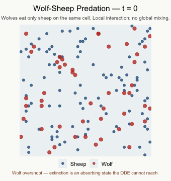
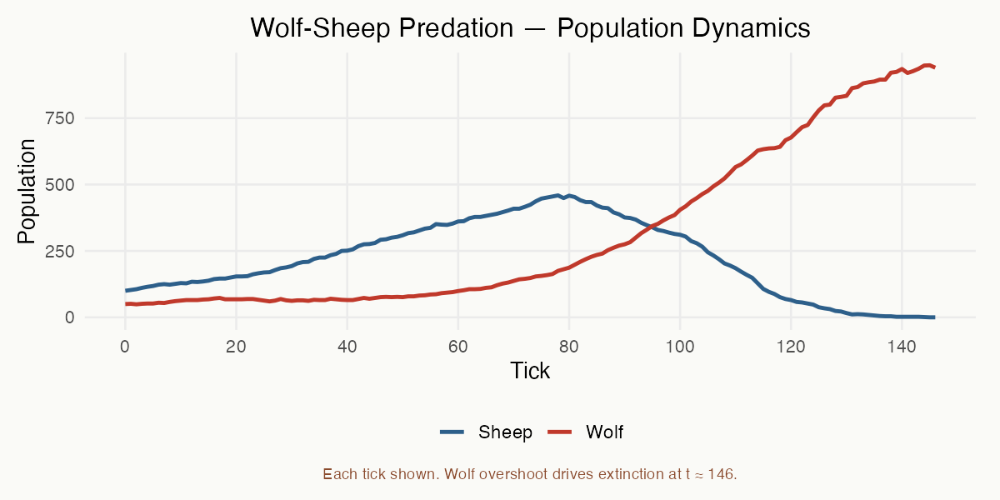
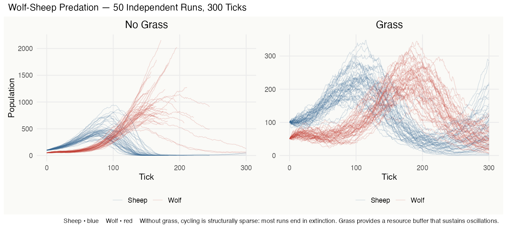

```{r setup, include=FALSE}
knitr::opts_chunk$set(
  echo       = TRUE,
  warning    = FALSE,
  message    = FALSE,
  fig.retina = 3,
  fig.align  = "center",
  out.width  = "100%"
)

library(tidyverse)
library(deSolve)
library(igraph)
library(tidygraph)
library(ggraph)
library(gganimate)
library(patchwork)
library(showtext)
font_add("Source Serif 4",
         regular = "../_theme/fonts/SourceSerif4-Regular.ttf",
         bold    = "../_theme/fonts/SourceSerif4-SemiBold.ttf",
         italic  = "../_theme/fonts/SourceSerif4-Italic.ttf")
font_add("Raleway",
         regular = "../_theme/fonts/Raleway-Light.ttf",
         bold    = "../_theme/fonts/Raleway-Bold.ttf")
font_add("Fira Code",
         regular = "../_theme/fonts/FiraCode-Regular.ttf")
showtext_auto()

theme_set(
  theme_minimal(base_family = "Source Serif 4") +
    theme(
      plot.title       = element_text(family = "Raleway", face = "plain",
                                      size = 14, margin = margin(b = 8)),
      plot.subtitle    = element_text(family = "Source Serif 4", size = 11,
                                      color = "#555555", margin = margin(b = 12)),
      axis.title       = element_text(family = "Source Serif 4", size = 10),
      legend.position  = "bottom",
      panel.grid.minor = element_blank(),
      plot.background  = element_rect(fill = "#FAFAF7", color = NA)
    )
)

palette_ch2 <- c(
  prey        = "#2D5F8A",
  predator    = "#8A4A2D",
  susceptible = "#2D5F8A",
  infectious  = "#C0392B",
  recovered   = "#27AE60"
)
```

---

## Where We Left Off

Block 1 derived two classical dynamical models from explicit assumptions and identified what is hiding in their structure.

--

The product term $\beta NP$ says that every predator is equally likely to encounter every prey individual at every instant. The mass-action term $\beta SI$ says the same about susceptibles and infectious individuals.

--

This is the mean-field assumption. It is not stated as an assumption — it is embedded in the functional form. It is doing the work that makes the analytical results possible.

--

**The question Block 1 ended with:** What if individuals were actually individual?

???
Speaker notes: This slide orients returning audience members. The key move is to remind them that what follows is not a different subject — it is the same question asked with a different instrument. The mean-field assumption was identified precisely in Block 1; Block 2 relaxes it and shows what becomes visible.

---

## Block 2: Agents, Networks, and the Geometry of Interaction

.pull-left[
**The argument**

- What an agent is — and what the neighborhood means
- ABM Lotka-Volterra: the reduction result, then the gap
- ABM SIR: random mixing, then network structure
- The reduction principle stated cleanly
- Nominal parameters versus effective dimensionality
]

.pull-right[
**The conclusion**

The ODE is not a competing paradigm. It is a limiting case — what the ABM becomes when the mean-field assumption is exact. Many standard density-dependent ABMs recover the ODE in that limit.

What lies outside that limit is the subject of this block.
]

???
Speaker notes: Set the tone immediately: this is not an argument that ODE models are wrong. It is a demonstration that they are a special case of a richer language. The statistician analogy that will carry the session is regularization — the ODE is the ABM with a very strong prior. Do not state this yet. Let it arrive after the reduction result is shown.

---

## What Is an Agent?

An agent is an entity with three things:

--

**A state.** A set of variables that describe the agent at a given moment — species, health status, wealth, location, opinion.

--

**Rules.** A function from the agent's current state and its neighborhood to its next state. Not a utility function. Not an optimization. A rule.

--

**A neighborhood.** A set of other agents it can interact with — the agents that appear in its rules.

--

The neighborhood is the structural innovation. In the ODE, every agent's neighborhood is the entire population, weighted uniformly. In the ABM, the neighborhood is local, structured, and can differ across agents.

What you can say in this language that you cannot say in the ODE's language — that is the point.

???
Speaker notes: The neighborhood concept is the load-bearing idea. Everything else follows from it. In the ODE, the neighborhood is implicit and uniform — the mass-action term embeds it without naming it. In the ABM, it is explicit and potentially heterogeneous. This makes it a first-class object: something you can vary, model, and test hypotheses about. Statisticians will recognize the analogy to specifying a covariance structure — the ODE is like assuming independence, the ABM lets you specify the structure.

---

## ABM Lotka-Volterra: The Rules

Three rules. No differential equations required.

--

**Rule 1 — Prey reproduction:** At each timestep, each living prey agent reproduces with probability $p_{\text{birth}}$. A new prey agent is added to the population.

--

**Rule 2 — Predation:** Each living predator is paired with a randomly selected prey agent. With probability $p_{\text{eat}}$, the prey is removed and a new predator is added.

--

**Rule 3 — Predator death:** Each living predator dies with probability $p_{\text{death}}$ per timestep.

--

Random pairing in Rule 2 is the mean-field assumption — explicit, named, and adjustable. We can relax it. We will.

--

The per-step probabilities are discrete-time analogues of continuous-time rates. Exact conversion depends on the timestep and update scheme; for a rate $\lambda$, a common conversion is $p = 1 - e^{-\lambda \Delta t}$.

???
Speaker notes: The rules are deliberately verbal before they are computational. This is intentional — the verbal statement is the model; the code is just the execution. A model that can only be described in code is a model that cannot be criticized. These three rules map directly to the three terms in the Lotka-Volterra ODEs: alpha*N, beta*N*P, gamma*P. The correspondence will be made visible in the reduction result.

---

## ABM Lotka-Volterra: Core Code

```{r abm-lv-def, echo=TRUE}
set.seed(42)
step_lv <- function(pop, p_birth = 0.15, p_kill = 0.00375,
                    p_convert = 0.267, p_death = 0.10, max_pop = 5000L) {
  prey <- filter(pop, type == "prey")
  pred <- filter(pop, type == "predator")
  N <- nrow(prey); P <- nrow(pred)
  nb <- rbinom(1, N, p_birth)           # Rule 1: prey reproduce
  new_prey <- tibble(id = max(pop$id) + seq_len(nb), type = "prey")
  kills <- rbinom(P, N, p_kill)         # Rule 2: each predator kills Binom(N,p_kill) prey
  dead  <- unique(unlist(lapply(kills[kills > 0],
             function(k) slice_sample(prey, n = min(k, N))$id)))
  prey  <- filter(prey, !id %in% dead)
  np    <- rbinom(1, length(dead), p_convert)
  new_pred <- tibble(id = max(pop$id) + nb + seq_len(np), type = "predator")
  pred  <- pred[rbinom(P, 1, 1 - p_death) == 1, ]  # Rule 3: predators die
  # Safety cap: prevent runaway prey growth in low-predation phases
  if (nrow(prey) + nrow(new_prey) > max_pop) {
    message("max_pop cap triggered: prey capped at ", max_pop,
            " (uncapped count would be ", nrow(prey) + nrow(new_prey), ")")
    new_prey <- slice_head(new_prey, n = max(0L, max_pop - nrow(prey)))
  }
  bind_rows(prey, pred, new_prey, new_pred)
}
```

???
Speaker notes: The code structure mirrors the verbal rules exactly. `rbinom` calls make the stochasticity explicit. Rule 2 is the mean-field assumption in code: each predator independently samples every prey individual with probability `p_kill`. The expected number of kills is `p_kill × N × P = β N P` — the functional form $\beta NP$ written procedurally. `p_kill` maps directly to β; `p_kill × p_convert` maps to δ.

---

```{r abm-lv-run, echo=TRUE}
run_lv_abm <- function(T = 300, n_prey0 = 60, n_pred0 = 15,
                       p_birth = 0.15, p_kill = 0.00375,
                       p_convert = 0.267, p_death = 0.10, seed_val = 42) {
  set.seed(seed_val)
  pop <- tibble(id   = seq_len(n_prey0 + n_pred0),
                type = c(rep("prey", n_prey0), rep("predator", n_pred0)))
  counts <- tibble(time = 0L, prey = n_prey0, predator = n_pred0)
  for (t in seq_len(T)) {
    if (nrow(filter(pop, type == "prey")) == 0 ||
        nrow(filter(pop, type == "predator")) == 0) break
    pop    <- step_lv(pop, p_birth, p_kill, p_convert, p_death)
    counts <- add_row(counts, time = t, prey = sum(pop$type == "prey"),
                      predator = sum(pop$type == "predator"))
  }
  counts
}
abm_runs <- map_dfr(1:10, ~ run_lv_abm(seed_val = .x) |> mutate(run = .x))
```

???
Speaker notes: The early termination condition — `if (nrow(...) == 0) break` — detects a finite-time extinction event. From positive initial conditions, the deterministic ODE remains nonnegative and does not hit zero in finite time. The finite stochastic population can hit zero, after which the ABM respects the absorbing boundary.

---

## The ODE Is Not a Different Model

Before showing the comparison:

The ODE is not a competing model of the same system.

It is what *this* model — the ABM with random pairing — becomes when you take the mean-field assumption to its limit: infinite population, perfect randomness at every timestep, all stochastic variation averaging away.

--

Under homogeneous agents, random mixing, compatible event-rate scaling, and a large-population limit, the normalized ABM converges to the mean-field ODE over finite time horizons. Relaxing those restrictions permits dynamics that the mean-field ODE does not represent.

--

An ODE is an ABM under maximal regularization — a conceptual synthesis rather than a universal theorem.

???
Speaker notes: State the conditions before showing the reduction plot: a density-dependent process, compatible event-rate scaling, homogeneous agents, random mixing, and a large-population limit over a finite time horizon. Under those conditions, convergence to the ODE is a theorem. The finite simulation is an approximation to that limit, not its exact expectation.

---

## The Reduction Result

```{r lv-reduction-plot, echo=FALSE, fig.height=4.2, fig.width=11}
# ODE solution for comparison (matching ABM parameters approximately)
lotka_volterra <- function(t, state, parameters) {
  with(as.list(c(state, parameters)), {
    dN <- alpha * N - beta * N * P
    dP <- delta * N * P - gamma * P
    list(c(dN, dP))
  })
}
# ODE parameters calibrated to match ABM rates exactly:
# alpha = p_birth = 0.15, beta = p_kill = 0.00375,
# delta = p_kill * p_convert = 0.001, gamma = p_death = 0.10
params_ode <- c(alpha = 0.15, beta = 0.00375, delta = 0.001, gamma = 0.10)
state0_ode <- c(N = 60, P = 15)
times_ode  <- seq(0, 300, by = 1)
lv_ode_df  <- as_tibble(as.data.frame(
  ode(y = state0_ode, times = times_ode,
      func = lotka_volterra, parms = params_ode)
))

p_prey <- ggplot() +
  # ABM ribbons — stochastic variation as translucent lines
  geom_line(data = abm_runs,
            aes(x = time, y = prey, group = run),
            color = "#2D5F8A", alpha = 0.25, linewidth = 0.6) +
  geom_line(data = lv_ode_df,
            aes(x = time, y = N),
            color = "#2D5F8A", linewidth = 1.4) +
  labs(title = "Prey", x = "Time", y = "Count")

p_pred <- ggplot() +
  geom_line(data = abm_runs,
            aes(x = time, y = predator, group = run),
            color = "#8A4A2D", alpha = 0.25, linewidth = 0.6) +
  geom_line(data = lv_ode_df,
            aes(x = time, y = P),
            color = "#8A4A2D", linewidth = 1.4) +
  labs(title = "Predator", x = "Time", y = "Count")

p_prey + p_pred +
  plot_annotation(
    title    = "ABM (translucent) over ODE (solid): the reduction result",
    subtitle = "Random mixing, N = 75 — ABM tracks ODE mean; stochastic noise visible"
  )
```

???
Speaker notes: The solid line is the ODE. The translucent traces are ten ABM runs with different random seeds. At this population size, the ABM orbits near the ODE solution — but notice the variance. Some runs track closely; a few diverge. The divergence will become the subject of the next slide. The key message: convergence is real, but it requires large N and random mixing. Both conditions are assumptions of the ODE.

---

## The ODE Cannot See This

```{r lv-extinction, echo=FALSE, fig.height=4.0, fig.width=11}
set.seed(99)
# Small-population ABM — extinction events become common
small_runs <- map_dfr(1:20, ~ run_lv_abm(
  T = 300, n_prey0 = 20, n_pred0 = 8,
  p_birth = 0.15, p_kill = 0.00375, p_convert = 0.267, p_death = 0.10,
  seed_val = .x
) |> mutate(run = .x))

# ODE for small population — same parameters, same initial conditions
state0_small <- c(N = 20, P = 8)
lv_small_ode <- as_tibble(as.data.frame(
  ode(y = state0_small, times = times_ode,
      func = lotka_volterra, parms = params_ode)
))

p_extinct <- ggplot() +
  geom_line(data = small_runs,
            aes(x = time, y = prey, group = run),
            color = "#2D5F8A", alpha = 0.3, linewidth = 0.6) +
  geom_line(data = lv_small_ode,
            aes(x = time, y = N),
            color = "#2D5F8A", linewidth = 1.4) +
  labs(title = "Prey (N = 20 initial)",
       subtitle = "ODE orbits forever — ABM can collapse to zero",
       x = "Time", y = "Prey count")

p_extinct
```

**The deterministic ODE cannot reach extinction from a positive initial condition.**

Zero is an invariant boundary: a population remains extinct if it starts at zero, but an interior Lotka–Volterra trajectory cannot hit zero in finite time. A finite stochastic ABM can hit zero with positive probability, after which extinction is absorbing.

???
Speaker notes: Some of the translucent lines hit zero and stay there — extinction. The ODE line continues cycling, because a differential equation defined at the origin has no mechanism for absorbing state dynamics. The ODE is not wrong about the populations it was designed to describe — large, well-mixed, continuous. It is incapable of expressing a phenomenon that requires discreteness and small-number stochasticity. The ODE cannot say "the population went extinct." The phrase is grammatically forbidden in its language.

---

## ABM SIR: Random Mixing

```{r abm-sir-def, echo=TRUE}
set.seed(123)
run_abm_sir <- function(N = 500, beta = 0.3, gamma = 0.1,
                        T = 150, seed_val = 123) {
  set.seed(seed_val)
  status  <- c("I", rep("S", N - 1))
  results <- tibble(time = 0L, S = N - 1L, I = 1L, R = 0L)
  for (t in seq_len(T)) {
    inf  <- which(status == "I"); susc <- which(status == "S")
    if (length(inf) > 0 && length(susc) > 0) {
      # Frequency-dependent transmission: each susceptible infected with prob beta*I/N
      # Expected new infections = S * beta * I / N — matches ODE's beta*S*I/N term exactly
      p_inf <- beta * length(inf) / N
      status[susc[rbinom(length(susc), 1, p_inf) == 1]] <- "I"
    }
    status[inf[rbinom(length(inf), 1, gamma) == 1]] <- "R"
    results <- add_row(results, time = t, S = sum(status == "S"),
                       I = sum(status == "I"), R = sum(status == "R"))
  }
  results
}
abm_sir_runs <- map_dfr(1:10, ~ run_abm_sir(seed_val = .x) |> mutate(run = .x))
```

???
Speaker notes: The infection mechanism implements frequency-dependent transmission: each susceptible is independently exposed with probability beta*I/N, so expected new infections = S * beta * I / N — the discrete-time counterpart of the ODE's beta*S*I/N term. This is the mean-field assumption in agent code: every susceptible is equally reachable by every infectious agent. Recovery is a Bernoulli trial with probability gamma, giving geometrically distributed infectious periods — the discrete analog of the ODE's exponential recovery.

---

## ABM SIR: Convergence to ODE

```{r sir-convergence-plot, echo=FALSE, fig.height=4.2, fig.width=11}
sir_ode <- function(t, state, parameters) {
  with(as.list(c(state, parameters)), {
    list(c(-beta * S * I / N,
            beta * S * I / N - gamma * I,
            gamma * I))
  })
}
N_sir <- 500
params_sir_ode <- c(beta = 0.3, gamma = 0.1, N = N_sir)
state_sir_ode  <- c(S = N_sir - 1, I = 1, R = 0)
times_sir_ode  <- seq(0, 150, by = 1)
sir_ode_df <- as_tibble(as.data.frame(
  ode(y = state_sir_ode, times = times_sir_ode,
      func = sir_ode, parms = params_sir_ode)
))

ggplot() +
  geom_line(data = abm_sir_runs,
            aes(x = time, y = I, group = run),
            color = "#C0392B", alpha = 0.3, linewidth = 0.7) +
  geom_line(data = sir_ode_df,
            aes(x = time, y = I),
            color = "#C0392B", linewidth = 1.5) +
  labs(title    = "Large-population limit under stated conditions",
       subtitle = "10 stochastic runs (translucent) scatter around the ODE solution (solid); residual spread is demographic stochasticity, shrinking as N grows",
       x = "Time (days)", y = "Infectious individuals")
```

???
Speaker notes: The convergence is clear at N = 500. The ABM runs cluster tightly around the ODE solution — peak timing, peak height, and tail behavior align. The residual variance is demographic stochasticity. For an appropriately scaled sequence of density-dependent population processes, the normalized stochastic process converges to the ODE on finite time intervals. Do not describe an arbitrary finite ABM as having the ODE as its exact expectation.

---

## Now Give Them an Address

Everything shown so far maintains the mean-field assumption. Random pairing means every agent's neighborhood is the entire population.

--

The neighborhood, previously a uniform draw from the full population at every timestep, becomes a specific set of nodes in a graph.

--

Agents have contact networks. A person's neighborhood is not "the population" — it is a set of specific individuals: household members, coworkers, transit contacts, friends. These relationships are persistent, structured, and heterogeneous.

--

What happens to an epidemic when you give the population a contact network?

???
Speaker notes: The transition is from the ODE's abstraction (the fully mixed population) to structured transmission. Contact networks matter here not because they look "more realistic," but because they introduce an object the ODE cannot represent: network topology. It becomes a variable that can be specified, altered, and tested.

---

## Activity: Model Autopsy

.activity[
**Groups of 3–4 — 15 minutes**

For each question, identify the distinction the model must retain:

- What will the epidemic peak be?
- Who should receive a limited vaccine supply?
- Does clustering protect part of the population?
- How variable are outcomes across outbreaks?

Can a mean-field SIR answer it? If not, what state or structure is missing?
]

Prepare one case to defend in a sentence.

???
Speaker notes: Ask groups to separate a poor answer from an impossible answer. After 10 minutes, collect one case from two or three groups. Reserve 5 minutes for the distinction: aggregate counts can support a peak estimate under mean-field assumptions; targeting and clustering require identities and topology; outbreak variability requires a stochastic model. The following network comparison is the empirical debrief.

---

## Two Networks, Same Mean Degree

```{r network-gen, echo=TRUE}
set.seed(77)  # for reproducibility
N_net  <- 500
k_mean <- 6   # mean degree for both networks

# Erdős-Rényi: random graph, Poisson degree distribution
er_graph <- sample_gnp(N_net, p = k_mean / (N_net - 1))

# Barabási-Albert: preferential attachment, power-law degree distribution
ba_graph <- sample_pa(N_net, m = k_mean / 2, directed = FALSE)

# Convert to tidygraph for visualization
er_tg <- as_tbl_graph(er_graph) |>
  mutate(degree = centrality_degree())
ba_tg <- as_tbl_graph(ba_graph) |>
  mutate(degree = centrality_degree())
```

Both networks have $\bar{k} \approx 6$. The same transmission and recovery parameters, and approximately the same mean degree, are used for both.

???
Speaker notes: Mean degree is fixed to isolate the effect of topology on epidemic dynamics. Everything else — transmission rate, recovery rate, initial infected fraction — will be identical. If the ODE were the correct model, we would see identical epidemic curves. What we will see is something quite different.

---

## The Networks: Erdős-Rényi vs. Barabási-Albert

```{r network-viz, echo=FALSE, fig.height=4.5, fig.width=11}
set.seed(55)

# Subsample for visualization clarity
er_sub <- er_tg |> activate(nodes) |> slice_sample(n = 80)
ba_sub <- ba_tg |> activate(nodes) |> slice_sample(n = 80)

p_er <- ggraph(er_sub, layout = "fr") +
  geom_edge_link(alpha = 0.2, color = "#AAAAAA") +
  geom_node_point(aes(size = degree), color = "#2D5F8A", alpha = 0.8) +
  scale_size_continuous(range = c(1, 6), guide = "none") +
  labs(title = "Erdős–Rényi", subtitle = "Degree ~ Poisson(6)") +
  theme_graph(base_family = "Source Serif 4") +
  theme(plot.background = element_rect(fill = "#FAFAF7", color = NA))

p_ba <- ggraph(ba_sub, layout = "fr") +
  geom_edge_link(alpha = 0.2, color = "#AAAAAA") +
  geom_node_point(aes(size = degree), color = "#8A4A2D", alpha = 0.8) +
  scale_size_continuous(range = c(1, 6), guide = "none") +
  labs(title = "Barabási–Albert", subtitle = "Degree ~ power law: a few very high-degree hubs") +
  theme_graph(base_family = "Source Serif 4") +
  theme(plot.background = element_rect(fill = "#FAFAF7", color = NA))

p_er + p_ba +
  plot_annotation(
    title = "Contact network structure: same mean degree, different topology",
    subtitle = "Node size proportional to degree"
  )
```

???
Speaker notes: The visual difference is immediate and striking. In the Erdős-Rényi graph, nodes are roughly uniform in size — similar degrees throughout. In the Barabási-Albert graph, a few large nodes (hubs) dominate. These hubs are connected to many other nodes. In an epidemic, they are both highly likely to be infected early (many contacts) and highly efficient at spreading infection further. The ODE sees only mean degree. It is blind to the variance.

---

## Erdős-Rényi vs. Barabási-Albert: What the Degree Distribution Implies

.pull-left[
**Erdős-Rényi**
- Degree distribution: Poisson
- No hubs — variance is low
- An epidemic spreads at roughly uniform speed through the network
- Final size and peak timing predictable from $\mathcal{R}_0$
]

.pull-right[
**Barabási-Albert**
- Degree distribution: power law
- A few hubs with very high degree
- Hubs infected early; epidemic spreads rapidly through them
- Faster initial growth, potentially larger final size
- Hubs as both amplifiers and potential targets for intervention
]

--

The ODE sees neither of these structures. It sees mean degree, and nothing else.

???
Speaker notes: The policy implication of the Barabási-Albert topology is significant: targeted vaccination of hubs is dramatically more efficient than random vaccination, because hubs carry a disproportionate share of the transmission. The ODE cannot represent this strategy. The network SIR can. This is not a matter of fit — it is a matter of the question being askable.

---

## Network SIR: Edge-Traversal Infection

```{r network-sir-def, echo=TRUE}
set.seed(101)
run_network_sir <- function(graph, N, beta = 0.15, gamma = 0.1,
                            T = 80, seed_val = 101) {
  set.seed(seed_val)
  status <- rep("S", N); status[sample(N, 1)] <- "I"
  adj    <- lapply(as_adj_list(graph), as.integer)
  results <- tibble(time = 0L, S = N - 1L, I = 1L, R = 0L)
  for (t in seq_len(T)) {
    new_st <- status
    for (i in which(status == "I")) {
      nb_s <- adj[[i]][status[adj[[i]]] == "S"]    # edges only — no mean-field
      new_st[nb_s[rbinom(length(nb_s), 1, beta) == 1]] <- "I"
      if (rbinom(1, 1, gamma) == 1) new_st[i] <- "R"
    }
    status  <- new_st
    results <- add_row(results, time = t, S = sum(status == "S"),
                       I = sum(status == "I"), R = sum(status == "R"))
  }
  results
}
```

```{r network-sir-run, echo=FALSE}
er_sir_runs <- map_dfr(1:10,
  ~ run_network_sir(er_graph, N_net, seed_val = .x) |>
    mutate(network = "Erdős-Rényi", run = .x))
ba_sir_runs <- map_dfr(1:10,
  ~ run_network_sir(ba_graph, N_net, seed_val = .x) |>
    mutate(network = "Barabási-Albert", run = .x))
network_sir_runs <- bind_rows(er_sir_runs, ba_sir_runs)
```

???
Speaker notes: The critical structural change from the random-mixing ABM: infection now traverses edges only. `adj[[i]]` gives the neighbors of node i; susceptibles among them are the only candidates for transmission. The ODE's $\beta SI$ term is replaced by edge-by-edge Bernoulli trials. The contact structure is now load-bearing, not abstracted away.

---

## Debrief: Same $\mathcal{R}_0$. Different World.

```{r network-epidemic-curves, echo=FALSE, fig.height=4.5, fig.width=11}
network_sir_runs |>
  ggplot(aes(x = time, y = I,
             color = network, group = interaction(network, run))) +
  geom_line(alpha = 0.35, linewidth = 0.7) +
  stat_summary(aes(group = network),
               fun = mean, geom = "line",
               linewidth = 1.6) +
  scale_color_manual(
    values = c("Erdős-Rényi" = "#2D5F8A",
               "Barabási-Albert" = "#8A4A2D"),
    name = NULL
  ) +
  labs(title    = "Epidemic curves by contact network topology",
       subtitle = "Same beta, gamma, N \u2014 thick lines are run averages",
       x = "Time (days)", y = "Infectious individuals") +
  theme(legend.position = "bottom")
```

???
Speaker notes: Both networks have the same mean degree and the same transmission parameters. The ODE predicts one epidemic curve. These networks produce qualitatively different dynamics: the Barabási-Albert epidemic peaks earlier, shows more variance across runs (because hub-seeding is a random event), and can sustain longer tails through hub persistence. The ODE's answer is neither of these — it is the mean-field average, which corresponds to neither topology. The question "what does contact network topology do to epidemic dynamics?" cannot be asked in the ODE's language. The answer it would give is not wrong. The question is simply exterior to its expressive range.

---

## The Reduction Principle

The reduction principle: familiar ODE models can be recovered from agent-based models when two structural restrictions are imposed — agent homogeneity and mean-field contact structure.

--

For an appropriately scaled density-dependent process, increasing population size under random mixing and agent homogeneity yields convergence to the ODE on finite time intervals. The structural restrictions and the limiting argument are both required.

--

Population size alone is not sufficient. A large structured network stabilizes around its own mean — not the ODE's mean-field value. The law of large numbers rescues the estimation of the structured-network dynamics, not convergence to the ODE. The contact structure must itself be random ($\Delta W = 0$) for the ODE limit to obtain.

--

In that limiting case, the ODE is not an approximation to the ABM. It is the reduced form obtained after imposing the relevant restrictions. Many standard density-dependent ABMs recover the corresponding ODE in the large-population, random-mixing, homogeneous-agent limit.

--

This reframes the apparent competition between the two paradigms. For the density-dependent models considered here, the ODE is recovered under homogeneity, mean-field contact, large-population scaling, and compatible event dynamics. The practical question is whether the phenomenon of interest is expressible after those restrictions are imposed.

???
Speaker notes: This is the central theoretical claim of the session, with conditions attached. A degenerate prior can enforce homogeneous agents or a fixed interaction structure, but that restriction alone does not prove the ODE limit; population scaling and compatible event dynamics are also required. Present the prior language as the course's interpretation of structural restriction, not as the convergence theorem itself.

---

## Nominal Parameters vs. Effective Dimensions

The ABM has more nominal parameters than the ODE: $p_{\text{birth}}$, $p_{\text{eat}}$, $p_{\text{death}}$, population size, initial conditions, network structure (when added).

--

But the calibrated dynamics are not more complex. Most of the parameter space produces qualitatively identical behavior — cycles, damped oscillations, or extinction. The consequential structure lives on a low-dimensional manifold.

--

This is regularization. The parameter space is high-dimensional in name; the effective dimensionality of the calibrated model is low.

--

A statistician who has used LASSO to recover a sparse signal from a high-dimensional regression has already solved this problem in a different guise. The critic who objects to ABM parameter proliferation is counting nominal parameters. They should count effective dimensions.

???
Speaker notes: This is the answer to the most common technical objection to ABMs — placed here, after the full demonstration, so it answers a question the audience has already formed rather than anticipating one they haven't. The Bayesian framing: maximal regularization corresponds to a prior concentrated entirely on the mean-field interaction structure — one that assigns essentially all mass to random mixing. That is not parameter parsimony; it is a structural restriction that has been silently imposed.

---

## Spatial Wolf-Sheep Predation

*Extension module — distributed in course materials; not walked through in the live session.*

Agents (sheep and wolves) move on a grid. A wolf can eat a sheep only if they occupy the same cell. No global mixing — contact structure is the grid neighborhood.

--

The result:

**Finite-time extinction.** Wolf overshoot drives the finite stochastic population to zero. The positive ODE trajectory orbits forever; the ABM can hit the absorbing boundary and stay there.

???
Speaker notes: The image is the argument. The ODE with these parameters produces neutral cycles indefinitely. The finite ABM produces boom-and-bust dynamics that terminate in extinction. Zero exists in the equations, but a positive deterministic trajectory does not hit it in finite time. Once the stochastic population hits zero, there is no recovery.

---

```{r spatial-lv-code, echo=TRUE, eval=FALSE}
# Wolf-Sheep Predation: R translation of Wilensky (2005) NetLogo model
# Full code: slides/render_spatial_anim.R
set.seed(2025)
G <- 51L  # 51x51 toroidal grid (NetLogo default)

wrap <- function(v, g) ((v - 1L) %% g) + 1L

# Each tick: agents random-walk, wolves lose energy, wolves eat sheep
# on same cell, agents die if energy < 0, agents reproduce stochastically.
# Local interaction: wolf must share a cell with a sheep to eat it.
# — full implementation in distributed materials —
```

???
Speaker notes: The key structural change from the random-mixing ABM is one line: wolves eat `sheep-here` — sheep on the same cell — not a random draw from the full population. That single restriction replaces the mean-field assumption with a local one. The rest of the model is standard energy bookkeeping. Show this code briefly, then switch to the pre-rendered image.

---

## [Spatial] Wolf-Sheep Predation

.center[
```{r spatial-lv-anim, echo=FALSE, out.width="42%"}

```
]

???
Speaker notes: Six snapshots from a single run. The ODE with equivalent parameters cycles forever. This finite ABM crashes to zero at t = 146, after which extinction is absorbing. The ODE contains zero as an invariant boundary, but a positive deterministic trajectory does not hit it in finite time. What is absent is the stochastic hitting event, not the numerical state zero.

---

## [Spatial] Wolf-Sheep — Population Over Time

.center[
```{r spatial-lv-ts, echo=FALSE, out.width="90%"}

```
]

???
Speaker notes: The same run, now shown as a time series. Sheep (blue) multiply unchecked at first; wolves (red) follow them up with a lag. At around t = 110 the wolves overshoot — 544 wolves, only 195 sheep remaining. The prey base collapses, and the wolves die off by t = 146. The ODE cycles forever because its positive deterministic trajectory does not hit zero in finite time; the finite ABM can hit the absorbing boundary.

---

## What If Sheep Need to Eat?

The no-grass model gives sheep unlimited energy. They reproduce freely; death comes only from wolves. The ODE assumes the same — prey grow at a fixed per-capita rate regardless of resource availability.

--

The grass variant (Wilensky 2005) adds one trophic level:

- Each patch is either **green** (grazeable) or **brown** (exhausted)
- A sheep on a green patch gains energy; the patch turns brown
- Brown patches regrow after a fixed number of ticks

--

Sheep now face an energy constraint independent of wolves. When sheep are scarce, grass accumulates. Recovered grass supports sheep recovery; sheep recovery supports wolf recovery.

--

The question: does this third level change the qualitative dynamics?

???
Speaker notes: The grass extension is not about realism for its own sake. It is about identifying which assumptions are load-bearing. The no-grass model assumes the prey resource is inexhaustible — exactly the assumption embedded in the ODE's linear prey growth term. Adding grass makes that assumption explicit and relaxes it. The next slide shows what changes when it is relaxed.

---

## Cycling Is Sparse Without Grass

.center[
```{r parallel-runs, echo=FALSE, out.width="95%"}

```
]

???
Speaker notes: 50 independent runs of each model variant, 300 ticks. Without grass (left), 47 of 50 runs end in wolf overshoot followed by sheep extinction — the boom-bust dynamic terminates. The ODE's cyclic solution is the rare outcome, not the typical one. Adding a third trophic level — grass that regenerates at a fixed rate — converts the picture: 49 of 50 grass runs sustain both species to t = 300. The grass acts as a resource buffer: when sheep are scarce, grass accumulates; recovered grass supports sheep recovery; sheep recovery supports wolf recovery. The ODE cycles forever by assumption. The no-grass ABM shows that assumption is doing real work. It is not a neutral modeling choice — it is the condition under which cycling is actually possible.

---

## Block 2: Summary

.pull-left[
**What we showed**

- The ABM is a more general language; the ODE is its mean-field limit
- Random mixing → ABM converges to ODE (the reduction result)
- Small populations → extinction; the ODE has no word for it
- Contact network topology changes epidemic dynamics qualitatively — same transmission parameters, different world
- Spatial structure generates phenomena exterior to the mean-field language
- ODE cycling requires conditions (grass, energy buffering) that are assumptions, not defaults — 47/50 no-grass runs go extinct
]

.pull-right[
**What this means**

- The ODE is an ABM under maximal regularization
- The "too many parameters" objection counts nominal dimensions, not effective ones
- The question is always: is the phenomenon I care about expressible in this language?
- If yes, use the simpler language
- If no, the simpler language does not merely give the wrong answer — it cannot give any answer
]

???
Speaker notes: Let the summary crystallize the argument: (1) the supposed competition between ODE and ABM is false—one contains the other; (2) the expressive boundary is the operative concept; (3) parsimony should be measured in effective dimensions, not parameter counts; and (4) phenomena visible only in the ABM require precisely the features excluded by the ODE's language.

---

## Toward Axtell

Block 3 asks a different kind of question.

Not "what happens to a population over time?" but "what is the distribution of outcomes across entities at a point in time?"

The firm size distribution has been stable for decades, across countries with radically different institutions. Its form is a power law. No model that replaces every firm with a single central reference value can reproduce it. No ODE model of industry dynamics can generate it.

The standard models are not giving the wrong answer. The phenomenon is outside their representable set — for exactly the same reason extinction events and topology-driven epidemics are outside the mean-field ODE.

The restriction is the constraint. The distribution is the evidence.

???
Speaker notes: The transition to Block 3 should feel like continuity, not a change of subject. The same conceptual move — identifying phenomena exterior to a language — now applies to a different domain: the distribution of firm sizes. The audience has seen the argument work twice (extinction, network topology). They are prepared to accept it a third time. The empirical stability of the power law is what makes the Axtell example devastating: this is not a modeling artifact. It is a regularity in the world, and the standard languages cannot express it.

---
class: center, middle

# Block 2 Complete

### Lunch — 12:30–2:00

*Block 3 begins at 2:00*

*All code at: github.com/jsschuler/statsABM*

???
Speaker notes: Remind the audience that the network SIR and spatial Lotka-Volterra code are fully implemented and commented in the distributed materials. If they want to run the spatial animation themselves, all dependencies are listed in the README.
